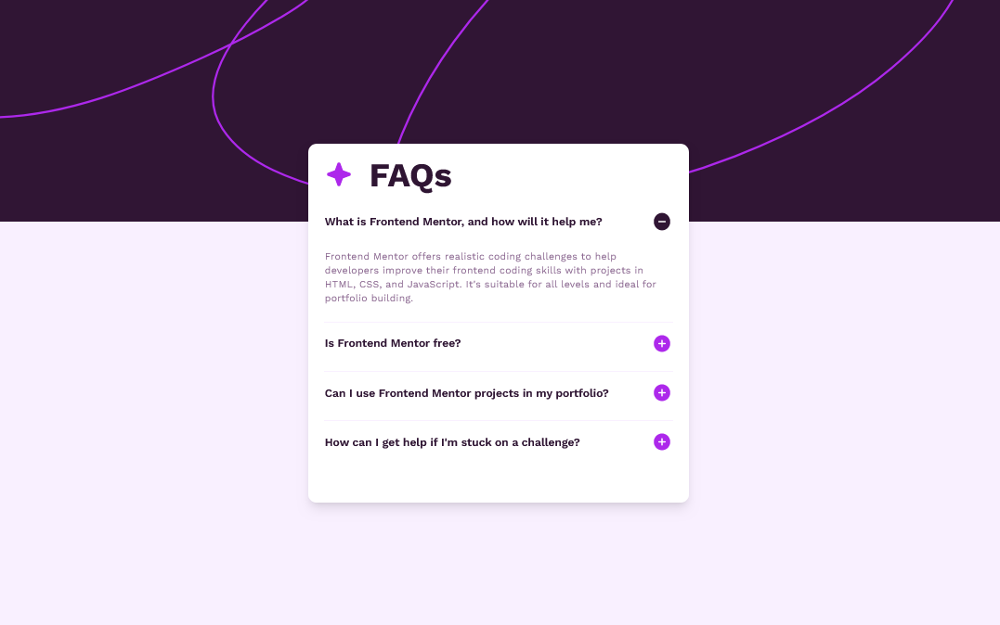
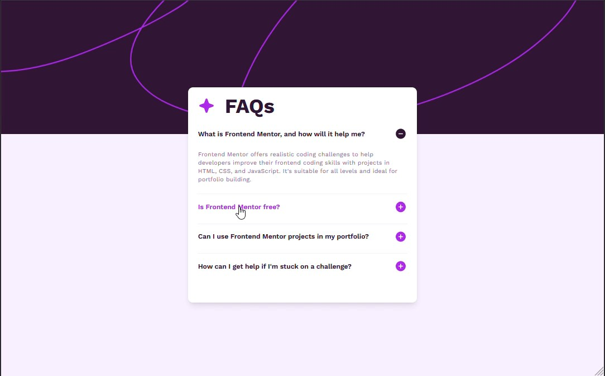
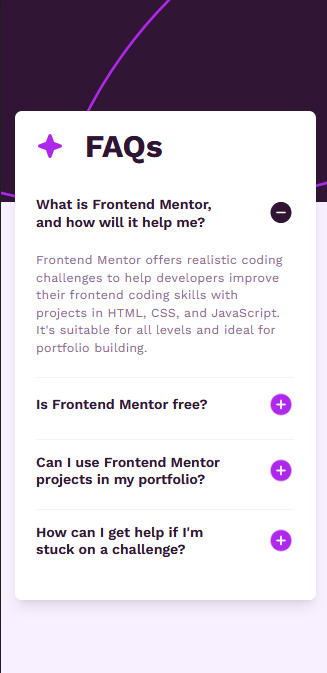

# Frontend Mentor - FAQ accordion solution

This is a solution to the [FAQ accordion challenge on Frontend Mentor](https://www.frontendmentor.io/challenges/faq-accordion-wyfFdeBwBz). Frontend Mentor challenges help you improve your coding skills by building realistic projects.

## Table of contents

- [Overview](#overview)
  - [The challenge](#the-challenge)
  - [Screenshot](#screenshot)
  - [Links](#links)
- [My process](#my-process)
  - [Built with](#built-with)
  - [What I learned](#what-i-learned)
  - [Useful resources](#useful-resources)
- [Author](#author)
- [Acknowledgments](#acknowledgments)

## Overview

### The challenge

Users should be able to:

- Hide/Show the answer to a question when the question is clicked
- Navigate the questions and hide/show answers using keyboard navigation alone
- View the optimal layout for the interface depending on their device's screen size
- See hover and focus states for all interactive elements on the page

### Screenshot

- Desktop version.
  
- Desktop active state version.
  
- Mobile version.
  

### Links

- Solution URL: (https://github.com/Abaljerind/faq-accordion-main)
- Live Site URL: (https://faq-accordion-main-tau.vercel.app/)

## My process

### Built with

- Semantic HTML5 markup
- Flexbox
- [TailwindCSS](https://tailwindcss.com/) - For styles

### What I learned

```html
<h1>Some HTML code I'm proud of</h1>
```

```js
const questions = Array.from({ length: 4 }, (_, i) =>
  document.getElementById(`question${i + 1}`),
);
const answers = Array.from({ length: 4 }, (_, i) =>
  document.getElementById(`answer${i + 1}`),
);
const iconPluses = Array.from({ length: 4 }, (_, i) =>
  document.getElementById(`iconplus${i + 1}`),
);
const iconMinuses = Array.from({ length: 4 }, (_, i) =>
  document.getElementById(`iconminus${i + 1}`),
);

questions.forEach((question, i) => {
  question.addEventListener("click", () => {
    answers[i].classList.toggle("hidden");
    iconPluses[i].classList.toggle("hidden");
    iconMinuses[i].classList.toggle("hidden");
  });
});
```

### Useful resources

- [TailwindCSS](https://tailwindcss.com/) - This helped me to do the styling more easy. I really liked this bootstrap and will use it going forward.
- [Vercel](https://vercel.com) - This is an amazing website which helped me to upload my website into the internet. I'd recommend it to anyone still learning to use this website.

## Author

- Website - [AbalJerind](https://faq-accordion-main-tau.vercel.app/)
- Frontend Mentor - [@Abaljerind](https://www.frontendmentor.io/profile/Abaljerind)

## Acknowledgments

I want to thank me for believing in me, I want to thank me for doing all this hard work. I wanna thank me for having no days off. I wanna thank me for never quitting. I wanna thank me for being me at all times.
